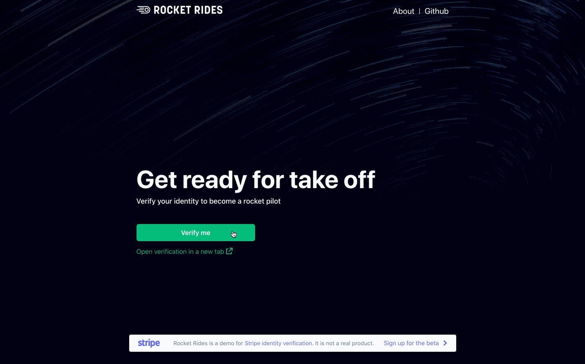

# Identity Verification API (beta) demo app

**Demo**

See a [hosted version](https://khw77.sse.codesandbox.io/) of the demo or fork a copy on [codesandbox.io](https://codesandbox.io/s/stripe-identity-verification-v2-khw77)



## How to run locally

This sample includes a Node server implementation. 

Follow the steps below to run locally.

**1. Clone the repository:**

```
git clone https://github.com/bz-stripe/identity-verification-sample
```

**2. Copy the env.example to a .env file:**

Copy the env.example file into a file named .env in the server folder. For example:

```
cp env.example server/.env
```

You will need a Stripe account in order to run the demo. Once you set up your account, go to the Stripe [developer dashboard](https://stripe.com/docs/development#api-keys) to find your API keys and update your .env file with the keys.

```
STRIPE_SECRET_KEY=<replace-with-your-secret-key>
STRIPE_WEBHOOK_SECRET=<replace-with-your-webhook-secret>
```

`CLIENT_DIR` tells the server where to the client files are located and does not need to be modified unless you move the server files.

**3. Install and run:**
```
npm install
npm start
```

**4. [Optional] Run a webhook locally:**

If you want to test the integration with a local webhook on your machine, you can use the Stripe CLI to easily spin one up.

First [install the CLI](https://stripe.com/docs/stripe-cli) and [link your Stripe account](https://stripe.com/docs/stripe-cli#link-account).

```
stripe listen --forward-to localhost:4242/webhook
```

The CLI will print a webhook secret key to the console. Set `STRIPE_WEBHOOK_SECRET` to this value in your .env file.

You should see events logged in the console where the CLI is running.

When you are ready to create a live webhook endpoint, follow our guide in the docs on [configuring a webhook endpoint in the dashboard](https://stripe.com/docs/webhooks/setup#configure-webhook-settings). 


## FAQ
Q: Why did you pick these frameworks?

A: We chose the most minimal framework to convey the key Stripe calls and concepts you need to understand. These demos are meant as an educational tool that helps you roadmap how to integrate Stripe within your own system independent of the framework.

Q: Can you show me how to build X?

A: We are always looking for new sample ideas, please email dev-samples@stripe.com with your suggestion!

## Author(s)
[@bz-stripe](https://twitter.com/atav32)
